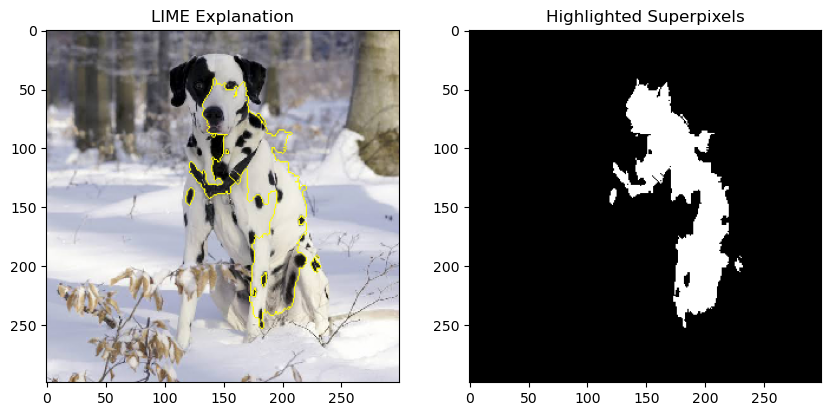

# Explainable AI Techniques: LIME Implementation

A technical implementation of Local Interpretable Model-agnostic Explanations (LIME) for image classification using InceptionV3. This project demonstrates how to generate and interpret local explanations for deep learning models on image data.

## 🚀 Features

- LIME for image classification (model-agnostic, local explanations)
- Visual explanation overlays on input images
- Superpixel-based feature importance visualization
- GPU-accelerated inference
- Pre-trained InceptionV3 model integration

## 📋 Prerequisites

- Python 3.8+
- CUDA-compatible GPU (recommended)
- pip package manager

## 🛠️ Installation

1. Clone the repository:
```bash
git clone https://github.com/calicartels/Explainable-Techniques-LIME.git
cd Explainable-Techniques-LIME
```

2. Install dependencies:
```bash
pip install -r requirements.txt
```

## 🎯 Usage

1. Open the Jupyter notebook:
```bash
jupyter notebook Explainable_Techniques.ipynb
```

2. Run the cells in sequence to:
   - Load and preprocess images
   - Generate predictions using InceptionV3
   - Create LIME explanations
   - Visualize important image regions

## 📊 Example Output

Below is a sample output from the notebook, showing a LIME explanation for a Dalmatian image:

<p align="center">
  
</p>

### Technical Explanation

- **Left: LIME Explanation**
  - The original input image is shown with yellow boundaries overlaying the most influential superpixels (segments) as determined by LIME.
  - LIME perturbs the input image by masking out superpixels and fits a local surrogate (linear) model to approximate the deep model's decision boundary in the neighborhood of the instance.
  - The highlighted regions are those that, when perturbed, most affect the model's prediction for the target class (here, Dalmatian).

- **Right: Highlighted Superpixels**
  - A binary mask showing only the superpixels deemed most important by LIME for the model's prediction.
  - This visualization isolates the regions that contribute most to the model's confidence, providing insight into what the model "sees" as salient features for the class.

#### Why Superpixels?
- Superpixels group pixels into perceptually meaningful atomic regions, reducing dimensionality and making explanations more interpretable.
- LIME uses these to efficiently perturb and analyze the image, rather than working at the pixel level.

#### LIME Algorithm (Image Mode)
1. Segment the image into superpixels.
2. Generate perturbed samples by randomly turning superpixels on/off.
3. Query the black-box model for each perturbed sample.
4. Fit a sparse linear model to the perturbed samples, weighted by similarity to the original image.
5. The coefficients of the linear model indicate the importance of each superpixel.

## 🤔 Why LIME?

LIME provides:
- Local interpretability for individual predictions
- Model-agnostic explanations
- Visual feedback on important image regions
- Transparent decision-making insights

## 📝 Notes

- The implementation uses InceptionV3 pre-trained on ImageNet
- GPU acceleration is recommended for faster processing
- Sample images are provided for demonstration

## 📚 References

- [LIME Paper](https://arxiv.org/abs/1602.04938)
- [InceptionV3 Paper](https://arxiv.org/abs/1512.00567)
- [scikit-learn Documentation](https://scikit-learn.org/stable/)
- [LIME Documentation](https://github.com/marcotcr/lime)

## 📄 License

This project is licensed under the MIT License - see the LICENSE file for details.

## 👥 Contributing

Contributions are welcome! Please feel free to submit a Pull Request.
